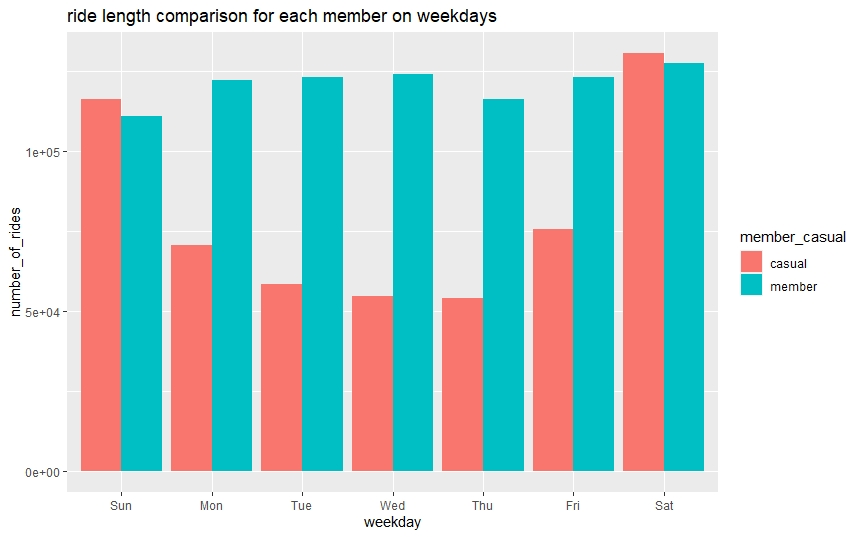
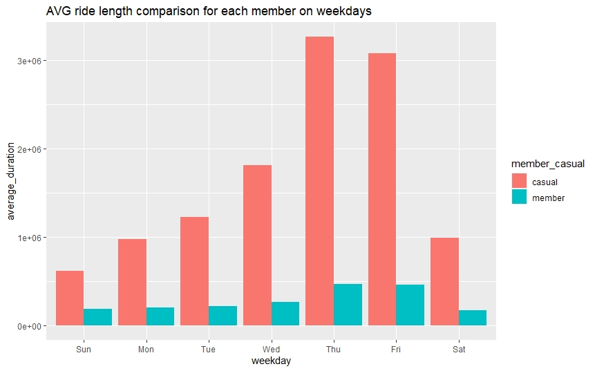

# Cyclistic data analysis(R)

Loading packages

```{r eval=FALSE}
library(tidyverse)
library(lubridate)
library(ggplot2)
```

Download [data](https://divvy-tripdata.s3.amazonaws.com/index.html), put the files in your current working directory and read them to a dataframe.

```{r eval=False}
file_names <- dir()
df <- do.call(rbind, lapply(file_names, read.csv))
```

Remove redundant columns.

```{r eval=FALSE}
df <- df %>%
  select(-c(start_lat, start_lng, end_lat, end_lng))
 ```
 Check if there are only 2 member types.
 
 ```{r eval=FALSE}
 dfgb <- df %>%
  group_by(member_casual) %>%
  count()
 ```
 
 Splitting the attribute *started_at* to get the day, month, year and weekday for further analyis.
 
 ```{r eval=FALSE}
df$date <- as.Date(df$started_at)
df$month <- format(as.Date(df$date), "%m")
df$day <- format(as.Date(df$date), "%d")
df$year <- format(as.Date(df$date), "%Y")
df$day_of_week <- format(as.Date(df$date), "%A")
 ```
 
 Add a new column *ride_length* to calculate the time taken for each ride(in seconds)
 
 ```{r eval=FALSE)
 df$ride_length <- difftime(df$ended_at, df$started_at)
 ```
 Convert *ride_length* to integer to perform calculations
 
 ```{r eval=FALSE}
 df$ride_length <- as.numeric(as.character(df$ride_length))
 ```
 
 Remove negative and zero values in the *ride_length* column and store it in another dataframe(not essential)
 
 ```{r eval=FALSE)
 df_v2<-filter(df, ride_length>0)
 ```
 
 Summary to calculate mean, median, maximum and minimum *ride_length*
 
 ```{r eval=FALSE)
 summary(df_v2$ride_length)
 ```
 
 Comparing member type by grouping them and calculating mean, median,  max and min.
 
 ```{r eval=FALSE}
mean_ridel <- aggregate(df_v2$ride_length ~ df_v2$member_casual, FUN=mean)
median_ridel <- aggregate(df_v2$ride_length ~ df_v2$member_casual, FUN=median)
max_ridel <- aggregate(df_v2$ride_length ~ df_v2$member_casual, FUN=max)
min_ridel <- aggregate(df_v2$ride_length ~ df_v2$member_casual, FUN=min)
```

Comparing above data against each week day, sorted by member type and weekdays.

```{r eval=FALSE}
df_v2 %>%
  mutate(weekday=wday(date, label=TRUE)) %>%
  group_by(member_casual, weekday) %>%
  summarise(number_of_rides = n(), average_duration = mean(ride_length)) %>%
  arrange(member_casual, weekday)
```

Visualize number of rides against weekday(for each member type) using ggplot2 and a clustered column chart.

```{r eval=FALSE}
df_v2 %>%
  mutate(weekday=wday(date, label=TRUE)) %>%
  group_by(member_casual, weekday) %>%
  summarise(number_of_rides = n(), average_duration = mean(ride_length)) %>%
  arrange(member_casual, weekday) %>%
  ggplot(aes(x=weekday, y=number_of_rides, fill=member_casual)) + geom_col(position="dodge")
```


Visualize average number of rides against weekday(for each member type) using ggplot2 and a clustered column chart.

```{r eval=FALSE}
df_v2 %>%
  mutate(weekday=wday(date, label=TRUE)) %>%
  group_by(member_casual, weekday) %>%
  summarise(number_of_rides = n(), average_duration = mean(ride_length)) %>%
  arrange(member_casual, weekday) %>%
  ggplot(aes(x=weekday, y=average_duration, fill=member_casual)) + geom_col(position="dodge")
```


Exporting analyzed data to an excel file

```{r eval=FALSE}
write.xlsx(mean_ridel, file="Analyzed_data.xlsx", sheetName = "mean_ridelen", row.names=FALSE)
write.xlsx(max_ridel, file="Analyzed_data.xlsx", sheetName = "max_ridelen", append=TRUE, row.names=FALSE)
write.xlsx(min_ridel, file="Analyzed_data.xlsx", sheetName = "min_ridelen", append=TRUE, row.names=FALSE)
write.xlsx(median_ridel, file="Analyzed_data.xlsx", sheetName = "median_ridelen", append=TRUE, row.names=FALSE)
write.xlsx(as.data.frame(agg_wkd), file = "Analyzed_data.xlsx", append=TRUE, col.names = TRUE, row.names=FALSE)
```
